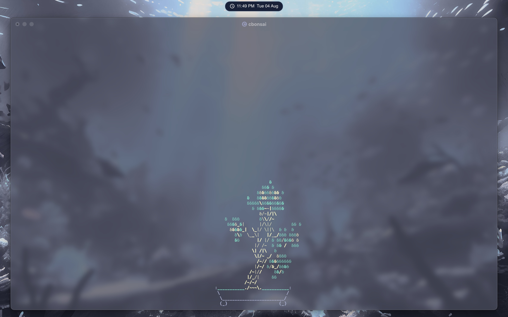

<div align="center">
  
  <h1>dotfiles</h1>
  
  <i>Personal macOS configuration managed with Nix and Home Manager.</i>
</div>

<p align="center">
    
</p>

## Structure

```
.
├── fastfetch/
├── flake.nix
├── flake.lock
├── home.nix
├── nvim/
├── sketchybar/
├── skhd/
├── starship/
├── wallpapers/
├── yabai/
└── iterm/
```

## Installation

Clone the repository:

```
git clone https://github.com/Mirzam1n5/dotfiles
cd dotfiles
```

Activate the configuration:

```
home-manager switch --flake .
```
